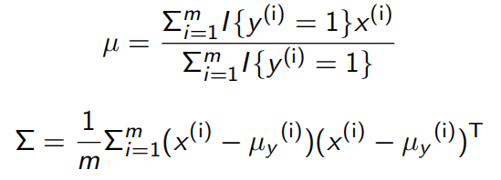

# Gaussian Discriminant Analysis
_GDA_ is a __generative learning algorithm__, where it learns P(x|y) rather than,
learning the mapping function between features(x) and labels(y) i.e. what discriminative algorithms do. In this type of algorithm, we try to model the
distribution of the features knowing their source(labels) _assuming_ they come
from a _Gaussian distribution_.

## Getting Started
__What is Gaussian Distribution?__ 
It is a classic distribution over single scalar random variable _'x'_, parameterized
by mean(_mu_) and standard deviation(_sigma_). Which looks like a typical bell
curve. It's probability density function is as follows:

__What is Multivariate Gaussian?__ 
A multivariate gaussian is a generalization of the gaussian defined over one
dimensional random variable, to multiple random variable at the same time. These
are vector valued random variable rather than univariate random variable. 
It's probability density function is as follows:

 

A multivariate gaussian in 2 dimension would look something like this, where the right hand side image shows the contour plot of the gaussian.

 

## Maximum Likelihood Estimates
Multivariate gaussian is __parameterized__ by __mean(_mu_)__ which controls the location of the gaussian and __covariance matrix(_sigma_)__ which controls the shape of the gaussian.  
__How to fit the training set?__ 
In order to fit these parameters, we need to maximize the joint likelihood. Once
we do this we would have the maximum likelihood estimates for mu and sigma. 
Refer this [link](https://www.youtube.com/watch?v=Dn6b9fCIUpM) for the derivation
of maximizing the joint likelihood. 

## Results
In the above code, GDA is used to perform bi-class classification, by modelling
class A and class B separately. Once we fit Multivariate Gaussians to each class
individually, we can get the probability of any new data point from the probability
density function.

#### Scatter plot of dataset
A two dimensional dataset with 100 data points from class A and 100 data points from
class B, where the red points show their mean.

#### Contour plot with decision boundary
After fitting Gaussians to both class independently, we can get an approximation
of the decision boundary as show in the contour plot.

#### 3D visualization of Gaussians
Better visualization of how GDA fits gaussians to the dataset would be as follows.
 

_Note: This plot is not for the provided dataset. This is to get an picture as of
how GDA fits gaussians to distribution._

